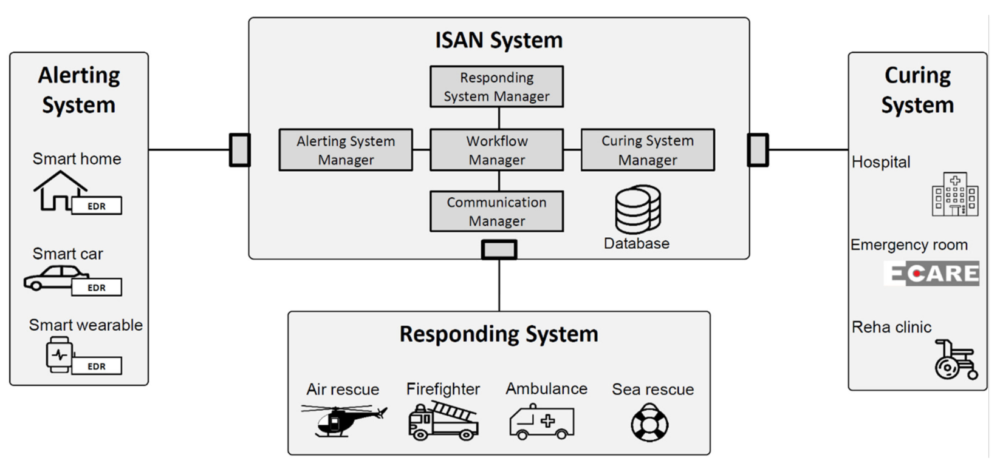

# Bachelor Thesis Project

**Note:** This repository contains only a small part of the overall project code. The uploaded files represent the core files where I contributed substantial blocks of code. I am not allowed to share the full project due to institutional restrictions. As a result, this code cannot be run independently. However, I will use this README to summarize the work I did.

- [Introduction](#1-introduction)
- [Objectives and Scope](#2-objectives-and-scope)
- [Work Description](#3-work-description)
- [Technologies Used](#4-technologies-used)

## 1. Introduction

The work presented in this thesis is part of the development of the **International Standard Accident Number (ISAN) Platform** — a digital platform designed to enable fully automated communication across all stakeholders in an emergency, including alerting systems, responding systems, and curing systems.

The **ISAN System's** goal is to digitize and automate the rescue chain, allowing systems to exchange critical information (such as time, location, and situation data) without manual intervention. This ensures faster and more reliable coordination, especially in cases where the person affected cannot communicate.

By promoting interoperability between devices and organizations, the **ISAN System** acts as a central hub for processing and forwarding ISAN-related events in real time.

The figure below illustrates the architecture of the **ISAN Communications Platform**, which connects all key components involved in emergency response.

- On the left, the **Alerting System (AS)** consists of smart environments such as smart homes, smart cars, and wearable devices — each capable of detecting incidents and triggering alerts.

- At the bottom, the **Responding System (RS)** includes practical rescue units such as ambulances, fire departments, air and sea rescue teams.

- On the right, the **Curing System (CS)** represents healthcare institutions like hospitals, emergency rooms, and rehabilitation clinics — which form the final link in the digital rescue chain.

- At the center of the platform lies the **ISAN System**, which acts as the coordination hub for the entire rescue chain. It is composed of several managers, each with a specific responsibility.

  - The **Alerting System Manager (ASM)** handles incoming alerts and prepares them for further processing. The **Responding System Manager (RSM)** coordinates communication with emergency services, while the **Curing System Manager (CSM)** interfaces with healthcare institutions. 
  
  - The **Workflow  (WFM)** ensures that all processes are executed in the correct order and sequence. Crucially, the **Communication Manager (ComMng)** is responsible for managing the data exchange between all systems, ensuring that information flows reliably and in real time.

   
  <em>Figure: ISAN Communications Platform overview</em>

## 2. Objectives and Scope

The primary objective of this thesis was to integrate the Rescuetrack API and MapQuest API into the ISAN System to enable real-time tracking of ambulances during emergency scenarios. This integration allows the system to retrieve and process live geolocation data from the responding units and display this information in the connected Curing Systems, such as hospitals or emergency rooms, to ensure better preparedness and coordination.

For more details, read **1.3 Task Description** in the Bachelor thesis pdf.

## 3. Work Description

<!--Placeholder-->

For the full overview, see **Sections 3.2, 3.3, and 3.4 (pages 18–42)** in the Bachelor thesis PDF.

## 4. Technologies Used

- Python (Flask)
- Javascript
    - Document Object Model
- REST API - MapQuest API
- SOAP API - Rescuetrack API
- Socket.IO
- HTML
- CSS

