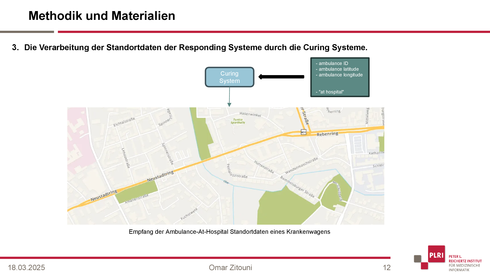

# Bachelor Thesis Project

**Note:** This repository contains only a **small part** of the overall project code. The uploaded files represent the core files where I contributed **substantial blocks** of code. I am not allowed to share the full project due to institutional restrictions. As a result, this code cannot be run independently. However, I will use this README to summarize the work I did.

- [Introduction](#1-introduction)
- [Objectives and Scope](#2-objectives-and-scope)
- [Development & Integration Overview](#3-development--integration-overview)
- [Technologies Used](#4-technologies-used)

   
  <em>Implemented Tracking Page - Overview</em>

To view a demonstration of the tracking feature, see the **video** included in the Video folder, where simulation scenarios were used to show the different cases that the system can now handle.

## 1. Introduction

The work presented in this thesis is part of the development of the **International Standard Accident Number (ISAN) Platform** — a digital platform designed to enable fully automated communication across all stakeholders in an emergency, including alerting systems, responding systems, and curing systems.

The **ISAN System's** goal is to digitize and automate the rescue chain, allowing systems to exchange critical information (such as time, location, and situation data) without manual intervention. This ensures faster and more reliable coordination, especially in cases where the person affected cannot communicate.

By promoting interoperability between devices and organizations, the **ISAN System** acts as a central hub for processing and forwarding ISAN-related events in real time.

The figure below illustrates the architecture of the **ISAN Communications Platform**, which connects all key components involved in emergency response.

- On the left, the **Alerting System (AS)** consists of smart environments such as smart homes, smart cars, and wearable devices — each capable of detecting incidents and triggering alerts.

- At the bottom, the **Responding System (RS)** includes practical rescue units such as ambulances, fire departments, air and sea rescue teams.

- On the right, the **Curing System (CS)** represents healthcare institutions like hospitals, emergency rooms, and rehabilitation clinics — which form the final link in the digital rescue chain.

- At the center of the platform lies the **ISAN System**, which acts as the coordination hub for the entire rescue chain. It is composed of several managers, each with a specific responsibility.

  - The **Alerting System Manager (ASM)** handles incoming alerts and prepares them for further processing. The **Responding System Manager (RSM)** coordinates communication with emergency services, while the **Curing System Manager (CSM)** interfaces with healthcare institutions. 
  
  - The **Workflow  (WFM)** ensures that all processes are executed in the correct order and sequence. Crucially, the **Communication Manager (ComMng)** is responsible for managing the data exchange between all systems, ensuring that information flows reliably and in real time.

   
  <em>Figure: ISAN Communications Platform overview</em>

## 2. Objectives and Scope

The primary objective of this thesis was to integrate the Rescuetrack API and MapQuest API into the ISAN System to enable real-time tracking of ambulances during emergency scenarios. This integration allows the system to retrieve and process live geolocation data from the responding units and display this information in the connected Curing Systems, such as hospitals or emergency rooms, to ensure better preparedness and coordination.

For more details, read **1.3 Task Description** in the Bachelor thesis pdf.

## 3. Development & Integration Overview

For simplicity, we will summarize the process of this integration in three parts. For the full overview of the methodology, read **Sections 3.2, 3.3, and 3.4 (pages 18–42)** in the Bachelor thesis PDF.

### 3.1 The preparation of location data by the Responding Systems before it is transmitted to the Curing Systems.

When a Responding System is assigned an ISAN (an alarm generated by the Alerting System that includes data such as time and location), it begins continuously querying its current coordinates from the Rescuetrack API.

The retrieved location data is then formatted and prepared for transmission in the correct structure:

- Initially, when the ambulance is en route to the incident location, the transmitted data includes the ambulance ID, its current coordinates (latitude and longitude), the incident location coordinates, and a marker labeled incident_location.
This marker indicates that the ambulance is still on the way to the scene.

- Once the patient is loaded into the ambulance, and this is confirmed by a button press, the system begins transmitting the hospital coordinates instead of the incident location.

- After arriving at the hospital, and upon confirmation (again via button), the data includes the marker at_hospital to signal that the transport is complete.

   

For the simulation, the MapQuest API is used to generate a route from a random or predefined starting point in Braunschweig city center to the simulated ISAN location.

The resulting coordinates are saved in a CSV file, which is later used to simulate the behavior of receiving real-time location data from the Rescuetrack API.

Similarly, once the generated ISAN is assigned a hospital, a second route — from the ISAN location to the hospital — is generated and appended to the same CSV file.

   

### 3.2 The transmission of location data from the Responding Systems to the Curing Systems.

1. When the tracking page is opened in the Curing System, the Workflow Manager is notified that the system is now waiting to receive location data from the Responding Systems.

2. The Workflow Manager verifies the Curing System via the Curing System Manager. Once verified, the request is forwarded to the Communication Manager.

3. If this is the first Curing System to request tracking data, The Communication Manager launches two separate threads:
    - The first queries the Responding System Manager for the IP addresses of all currently active Responding Systems.
    - The second uses those IPs to retrieve live location data, which it forwards to all Curing Systems that currently have the tracking page open.

   This process is repeated every 5 seconds, as long as at least one Curing System remains on the tracking page.

If a Curing System exits the tracking page, the Communication Manager is notified (just like in step 1) and stops sending data to that system.

   

For simulation scenarios, the process works similarly, with one key difference in step 3:

Before fetching the coordinates from the Responding Systems, the Communication Manager sends a POST request instructing them to start reading location data from a CSV file in a separate thread. This thread simulates real-time tracking by reading one line from the file every second

This simulated tracking thread automatically stops either when the user on the Curing System exits the tracking page or when the patient has been successfully transported to the hospital.

### 3.3 The processing of location data from the Responding Systems by the Curing Systems.

As the Curing System backend receives ambulance-to-incident location data from a Responding System, it emits this data to the Curing System frontend via Socket.IO.

Upon receiving the first data point, an ambulance marker and an incident marker are created at the corresponding coordinates. Additionally, the MapQuest API is used to retrieve the fastest route from the ambulance's current location to the incident site, and a route polyline is drawn on the map.

For each subsequent update, the ambulance marker is moved to its new position, and the route polyline is adjusted to start from the coordinate closest to the updated ambulance location.

   

The processing of ambulance-to-hospital location data works similarly, with one key difference:
Upon receiving the first update, the incident marker is replaced by an X marker, indicating that the patient has been loaded into the ambulance.

   

When the marker at_hospital is received in the location data of an ambulance, all related elements are removed from the map — including the ambulance marker, X marker, hospital marker, and the drawn route polyline.

   

## 4. Technologies Used

- Flask (Python)
- Javascript
    - Document Object Model
- MySQL
- Docker
- REST API - MapQuest API
- SOAP API - Rescuetrack API
- Socket.IO
- HTML
- CSS

